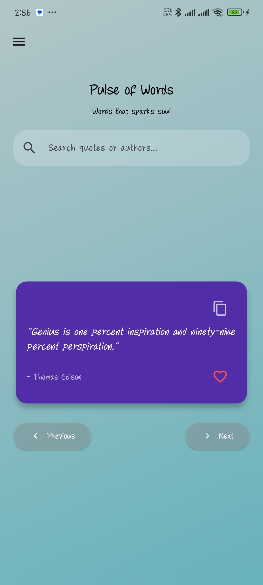
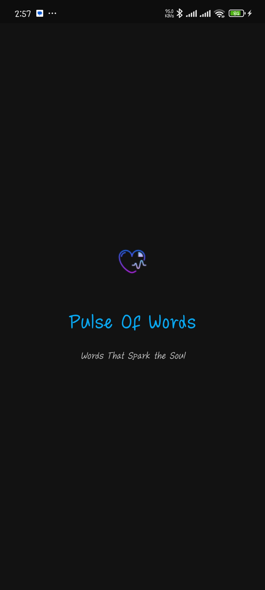
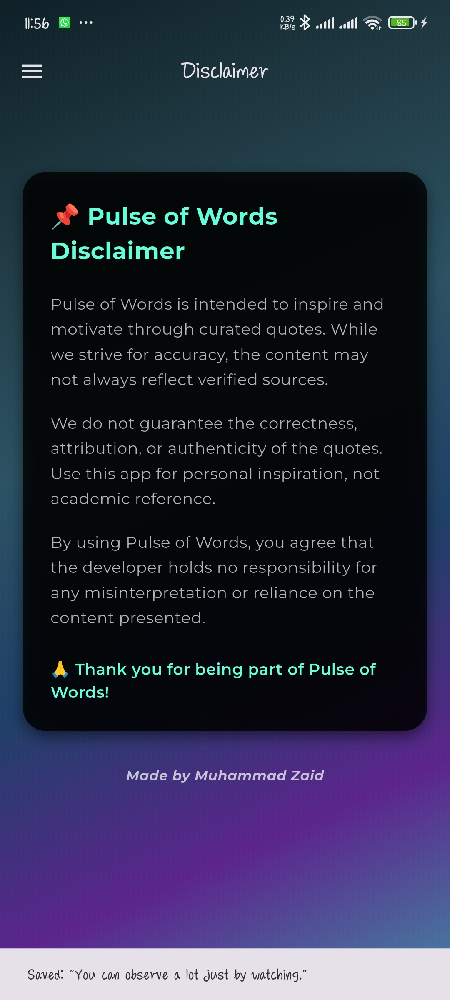
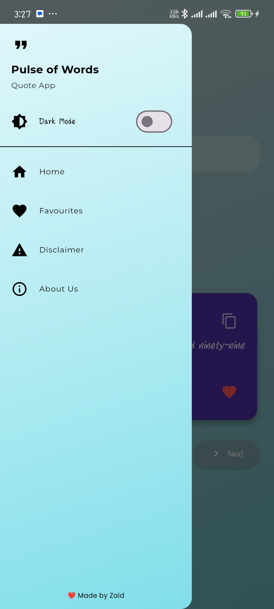
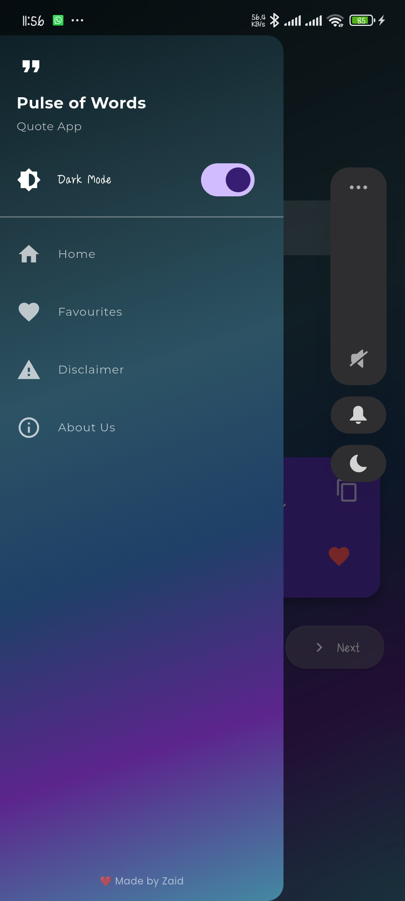
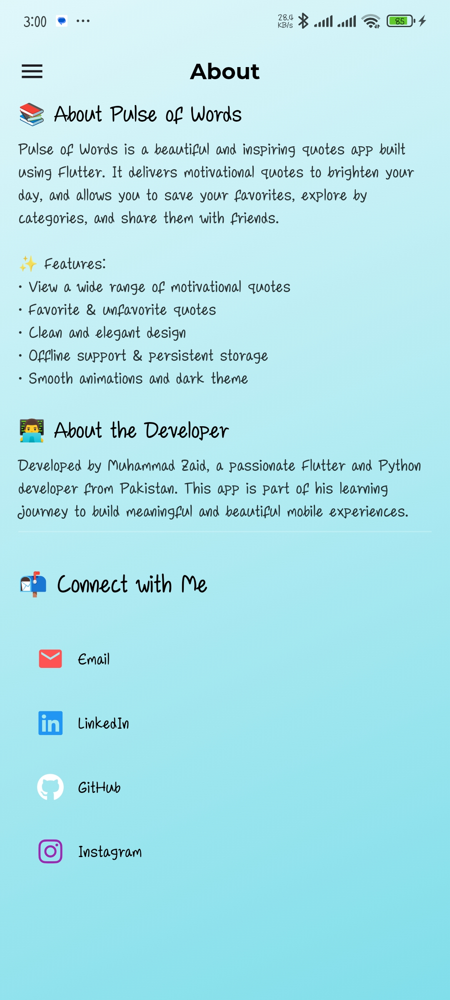
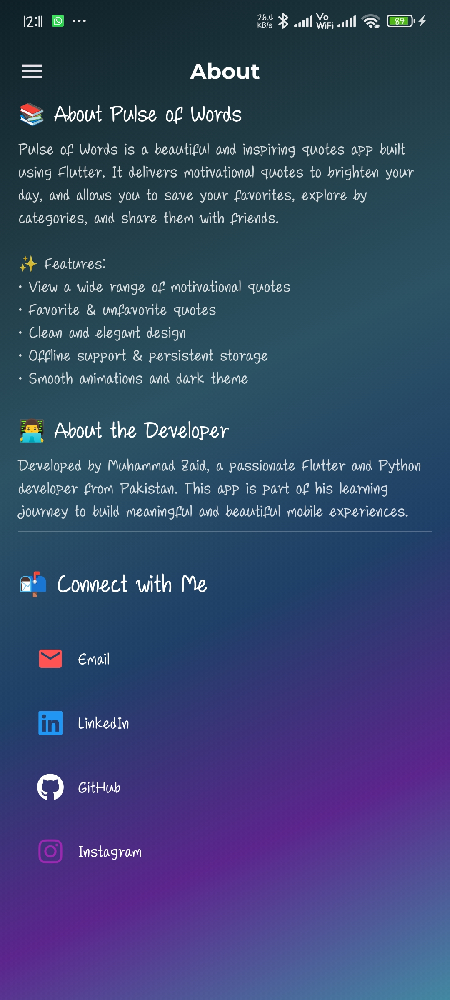

🌟 Pulse of Words
Pulse of Words is a beautifully crafted Flutter app that brings you a curated collection of inspirational and thought-provoking quotes. Users can browse, favorite, and revisit quotes — all offline. Designed with elegance and simplicity, the app is lightweight, smooth, and user-friendly.

📱 Features
🔁 Quote Carousel: Swipe to view a fresh quote every time.

💖 Favorites: Save your favorite quotes locally.

🔙 Previous Button: Revisit the last shown quote anytime.

🌙 Dark Mode Support

📦 Offline Access: Works without internet after initial load.

🎨 Clean UI/UX: Minimal, aesthetic, and accessible design.

📂 Project Structure
css
Copy
Edit
lib/
├── main.dart
├── models/
│   └── quote.dart
├── screens/
│   ├── home_screen.dart
│   └── favorites_screen.dart
├── services/
│   └── local_storage_service.dart
└── widgets/
    └── quote_card.dart
assets/
└── quotes.json

## App Screenshots
## App Screenshots
  
 

  
 

🛠️ Technologies Used
Flutter

Dart

Shared Preferences for local storage

JSON for quote data

Material Design
